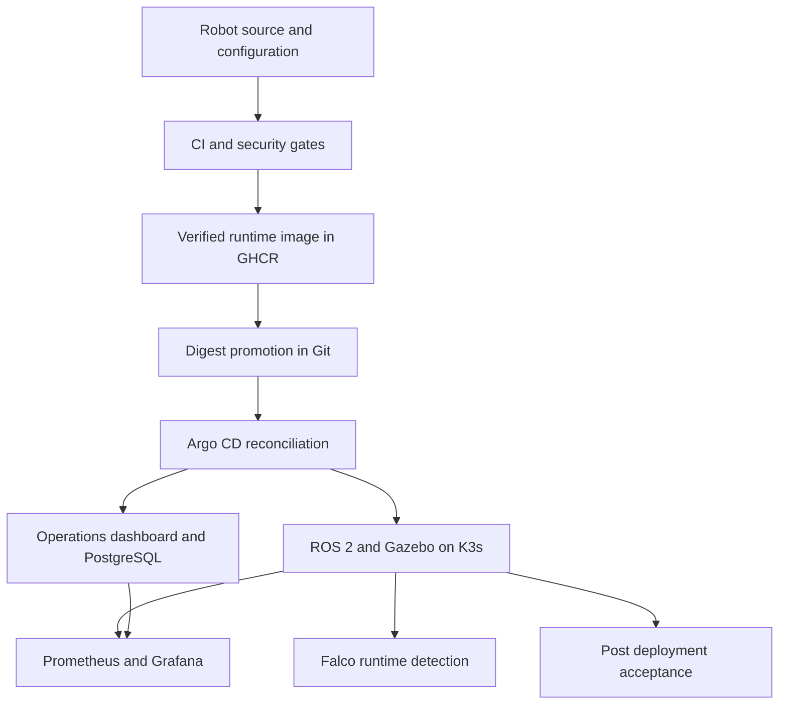

# Robotek 1.2

A robotics DevSecOps demonstrator that connects ROS 2 behavior, automated tests, software supply-chain verification, GitOps delivery, and live operations on AWS.

[](https://github.com/iheb-mrabet/robotek-1.2/actions/workflows/release.yml)
[](https://github.com/iheb-mrabet/robotek-1.2/actions/workflows/post-deploy-validation.yml)
[](https://github.com/iheb-mrabet/robotek-1.2/actions/workflows/infra-validation.yml)

**Live operations dashboard:** https://18-211-80-86.nip.io/

The AWS Learner Lab and Robotek EC2 instance must be running. The Elastic IP provides a stable address while it remains allocated and associated; the lab is a session-based, single-node demonstration environment.

## What the project demonstrates

- A simulated indoor delivery robot with odometry, LiDAR, transforms, waypoint navigation, delivery actions, and emergency-stop handling.
- CI with C++ and Python checks, unit tests, integration tests, and headless Gazebo tests.
- Security gates for secrets, source code, dependencies, images, infrastructure, and managed exceptions.
- Digest-pinned runtime images, SPDX and CycloneDX SBOMs, keyless Cosign signatures, and attestations.
- Helm applications reconciled by Argo CD into K3s on an Ubuntu AWS host.
- Live ROS telemetry, cluster readiness, GitOps state, Prometheus, Grafana, Alertmanager, and Falco.
- Post-deployment acceptance with retained evidence and runner recovery after reboot.

The robot is simulated. The dashboard reads deployed telemetry and reports unavailable sources explicitly.

## Architecture



## Delivery baseline

Acceptance on 3 October 2026 verified the final immutable runtime image, repeated ROS publication, completed delivery, concurrent-goal rejection, cancellation, emergency stop and explicit recovery, invalid destinations, public HTTPS health, and fresh Falco detection. Automated staging validation passed all eight checks. Recovery checks verified K3s, Caddy, the self-hosted runner, hourly credential renewal, all four Argo CD applications, and public database readiness after host restart.

- [Verified runtime release](https://github.com/iheb-mrabet/robotek-1.2/actions/runs/37120123963)
- [Current staging acceptance](https://github.com/iheb-mrabet/robotek-1.2/actions/runs/37120741854)
- [Full live behavioral and security acceptance](https://github.com/iheb-mrabet/robotek-1.2/actions/runs/37120833765)
- [Post-recovery acceptance](https://github.com/iheb-mrabet/robotek-1.2/actions/runs/36987968801)

Use the live dashboard and latest workflow evidence for the current state. A green build, a healthy pod, and a successful behavioral test provide different kinds of evidence.

## Repository map

| Path | Purpose |
|---|---|
| `src/` | ROS interfaces, robot description, simulation, control, behavior, telemetry, and tests |
| `demo/` | Nginx frontend, Flask API, PostgreSQL, and backend tests |
| `.github/workflows/` | CI, security, signed runtime delivery, demo delivery, and acceptance |
| `docker/` | Development, CI, and runtime container definitions |
| `deploy/helm/` | Runtime, dashboard, observability, and security charts |
| `deploy/argocd/` | Four Robotek applications tracking `main` |
| `infra/` | Terraform, bootstrap, runner registration, HTTPS configuration, and verification |
| `scripts/` | Reusable build, test, security, artifact, and deployment commands |
| `security/` | Security policies and controlled exception handling |
| `docs/` | Design decisions, operations, and artifact verification |

## Build and test locally

Use Ubuntu 24.04 with ROS 2 Jazzy and the dependencies documented in the repository scripts, or the supplied development container.

```bash
bash scripts/install_dependencies.sh
bash scripts/build.sh
source install/setup.bash
bash scripts/lint.sh
bash scripts/unit_tests.sh
bash scripts/python_coverage.sh
bash scripts/integration_tests.sh
bash scripts/simulation_tests.sh
```

```bash
docker compose -f docker/compose.yaml build
docker compose -f docker/compose.yaml run --rm mock-delivery-robot
```

## Operate the simulated robot

Inside a configured ROS shell:

```bash
source install/setup.bash
ros2 launch mock_robot_bringup full_simulation.launch.py gui:=false
```

In another ROS shell, submit a reachable goal after checking current odometry:

```bash
ros2 action send_goal /execute_delivery \
  mock_robot_interfaces/action/ExecuteDelivery \
  "{target_x: 0.8, target_y: 0.0}" --feedback
```

Emergency stop and release:

```bash
ros2 service call /mission/emergency_stop \
  mock_robot_interfaces/srv/EmergencyStop "{activate: true}"
ros2 service call /mission/emergency_stop \
  mock_robot_interfaces/srv/EmergencyStop "{activate: false}"
```

Observe the final action result. Goal acceptance alone does not prove completed delivery. Releasing emergency stop permits later work; it does not resume an interrupted goal.

## Operate staging

On the dedicated Robotek host, run the current checked-out verification script:

```bash
sudo -n bash /opt/robotek/repository/infra/scripts/verify-platform.sh
```

For a manually checked deployment, use the deployment scripts with a configured restricted kubeconfig:

```bash
export KUBECONFIG=/home/robotek-runner/.kube/config
bash scripts/deployment/verify_release.sh
bash scripts/deployment/smoke_test.sh
```

The runner is a dedicated systemd service. Its root-owned renewal helper replaces an eight-hour Kubernetes credential hourly and after boot. Access covers Robotek resource inspection and staging pod execution for ROS smoke tests; it does not grant the runner cluster-admin or Secret access.

## Workflow responsibilities

| Workflow | Responsibility |
|---|---|
| `ci.yml` | Lint, build, unit, integration, simulation, and CI gate |
| `security.yml` | Secrets, SAST, repository and CI image scans, exception policy |
| `build-package.yml` | Runtime validation, image scan, SBOMs, signing, attestations, publication |
| `release.yml` | CI and security orchestration, verified runtime delivery, digest promotion |
| `post-deploy-validation.yml` | Reconciliation, deployed digest, ROS smoke, evidence upload |
| `live-demo.yml` | Dashboard build, tests, security, GitOps promotion, live validation |
| `scheduled-staging-security.yml` | Periodic promoted-image and rendered-manifest rescan |
| `infra-validation.yml` | Infrastructure and configuration validation |

## Documentation

- [Runtime image verification](docs/runtime-image-verification.md)
- [AWS and runner operations](infra/README.md)
- [Observability design](docs/phase6-design.md)
- [Operations and maintenance](docs/phase6-operations.md)
- [Main branch governance](docs/branch-protection.md)
- [Roadmap](docs/backlog.md)

This delivery covers a single simulated robot and a single staging node. Multi-robot reuse, high availability, and production fleet operation remain separate roadmap work.
